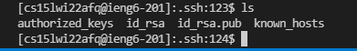
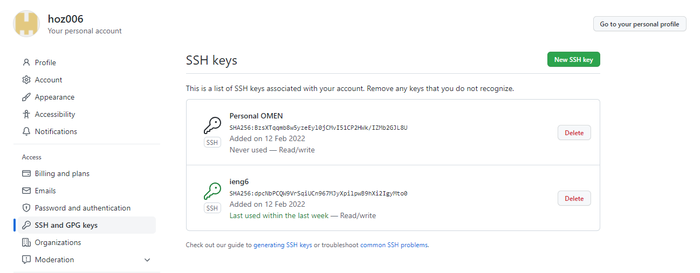
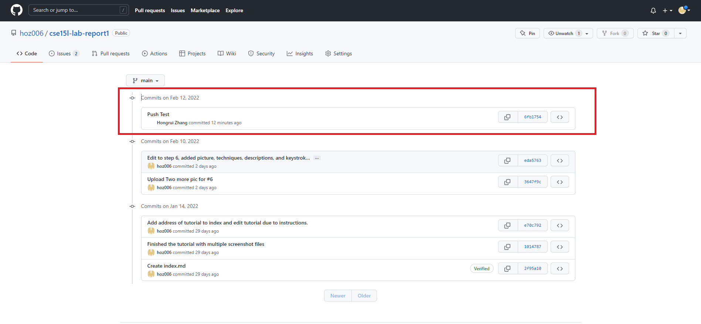

# Lab Report 3: "Set up Github Access from ieng6"

## 1. Generate the key
First, use ssh-keygen on ieng6 to create a ssh key so that we can use to access github, allowing us to commit and push the changes to the web. This will generate a key in the .ssh forlder (It should be hidden but can be accessed with cd .ssh) The result is shown below.

---

## 2. Copy public key to github
Then we need to copy the public key to github. Simply copy the contents in the public key (id_rsa.pub here) to account setting's ssh key on Github.

After this step, we are good to go!

---

## 3. Testing
Test whether we can push changes to github. (Pushing is only allowed on SSH if we clone it with the SSH and not http)

You can find the commit history on github to check whether it is successful on its end. See
[Github Commit History](https://github.com/hoz006/cse15l-lab-report/commit/6fb1754375d7f95cbb4c11bfe841c49cf574f045).