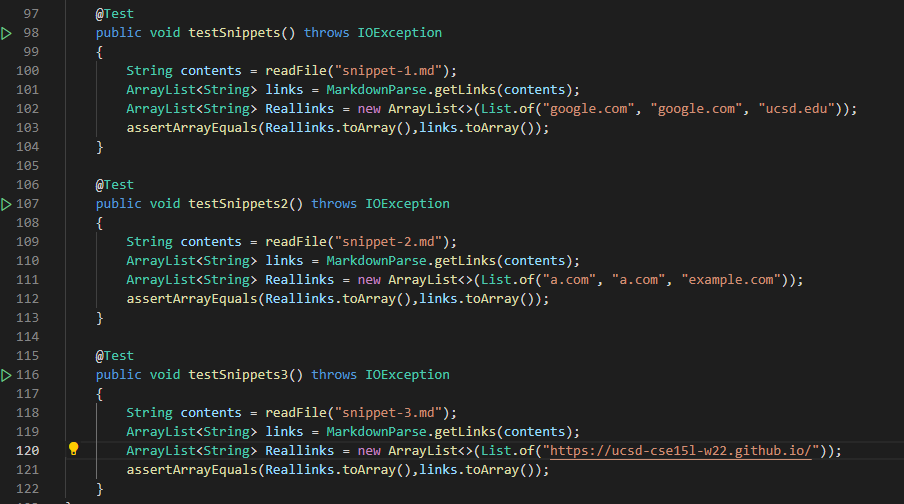
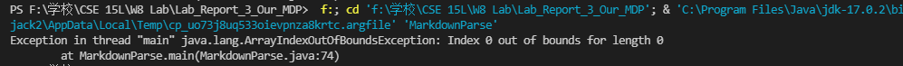

# Report 4 Reviewing & Testing Code
## Testing Our Mark-down Parse
[My MDP repository](https://github.com/hoz006/Lab_Report_3_Our_MDP)

The tester for the snippets are shown below:

And the results are shown below:

It seems like the error is the same for all three tests.

---

## Testing the Mark-down parse we reviewed
[Their MDP repository](https://github.com/m1ma0314/markdown-parse)

The testers for the snippets are the same as the testers above.

The results are shown below:

It seems like the error is the same for all three tests.

---
## Questions Section: 
- Do you think there is a small (<10 lines) code change that will make your program work for snippet 1 and all related cases that use inline code with backticks? If yes, describe the code change. If not, describe why it would be a more involved change.

Yes, We could make an exception to catch these errors and try to fix them on the spot. 

- Do you think there is a small (<10 lines) code change that will make your program work for snippet 2 and all related cases that nest parentheses, brackets, and escaped brackets? If yes, describe the code change. If not, describe why it would be a more involved change.

No. I think that invloving nested parentheses, brackets, and escaped brackets involves more problems in our mark-down parse code since it is related to the entire way of how link recognition works here.

- Do you think there is a small (<10 lines) code change that will make your program work for snippet 3 and all related cases that have newlines in brackets and parentheses? If yes, describe the code change. If not, describe why it would be a more involved change.

Yes. I think that this is similar to the first snippet, where it has a simple fix to incorporate the issue. We can simply add the circumstance into the code and we'll be good.