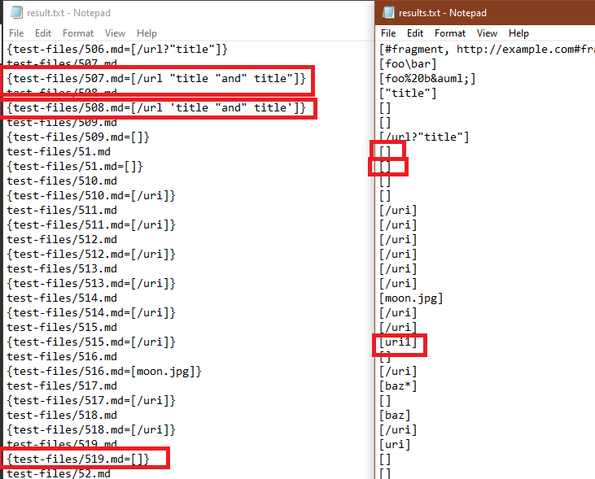

# Lab Report 5
## Differences

## Description
In the picture shown above, I highlighted three differences in the two results. And I will be analysing the bottom two(test-files/508 and test-files/519).

I used manual checking since the diff program gives too many outputs and made checking hard for me.

    > "[link](/url 'title "and" title')"
For test 508, which has test as shown above, should produce output [], because it is not a url. The implementation from the professor is correct and ours incorrect. The bug could possibly fixed by checking spacing in the url. If we check there's a space in between the url, it might be fixed.

    > ](uri2)](uri3)
For test 519, the second test, I think both implementation would be incorrect because there are three urls in here, which should produce 3 links as output. I think for this bug, we need to have a special case if there are multiple urls present.

    