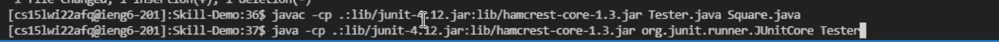
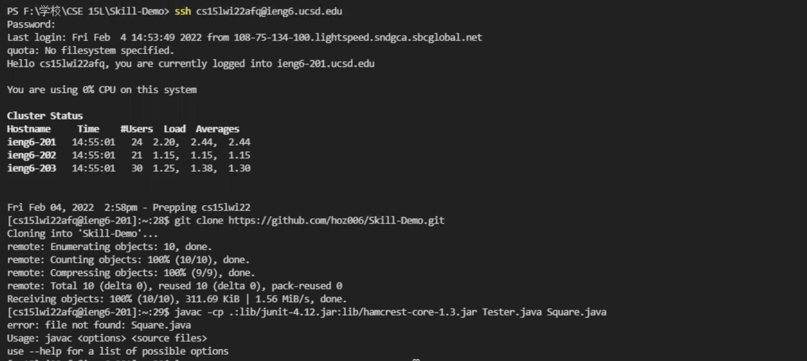

# Logging Into ieng6

Follow these methods below and you will be able to log into your course-specific account on ieng6.

## Index:
1. Installing VScode
2. Remotely Connecting
3. Trying Some Commands
4. Moving Files with scp
5. Setting an SSH Key
6. Optimizing Remote Running

Before you start, you need to know your username (email) and your password for the course-specific account. If not, go to [ETS website](https://sdacs.ucsd.edu/~icc/index.php) to lookup your account and password.

---

## 1. Installing VScode
There are a few ways we can connect to ieng6. For here, we will be using the texteditor VScode, therefore the first still will be installing VScode. To download VScode, go to [this website](https://code.visualstudio.com/Download) and click download for your system.

After download and installing, open the software and you sould get something like this.

---

## 2. Remotely Connecting
Then, in Visual Studio Code,we will connect to the remote computer using VSCode’s remote option.

For the first step, open a terminal in VSCode. Your command should look like this, but the account should be replaced the address in your course-specific account. Command:

> ssh account

It will then prompt you to enter your password. Notice that the string you enter will not show on here since the terminal hides the password. Press enter when you are done. If done correctly, you will have something like this.

---

## 3. Trying Some Commands
Now you are connected to the remote computer! The command you type in the terminal would be able to use the remote computer to execute. Try some command yourself!

Some useful command:
* ls  (print file and folder in directory)
* pwd  (print working direcotry)
* exit (logout of shell)
* cd (change)

---

## 4. Moving Files with scp
The command scp would allow us to move files from client (our computer) to the server. This will enable us to do many things later. Use command like this:

> scp [filename] [server-address]:~/

An example of moving a file is shown below. Here I moved file.md in my currently directory to the server. After the command it will prompt success and print the time it took to move the file.

---

## 5. Setting an SSH Key
Everytime we try to login to the server or to edit files on the server, it requires us to type or coping the password in, which is very time consuming. Therefore there's a way to make it simplier: setting an SSH Key.

This requires code:
>ssh-keygen    
mkdir .ssh

Execute the keygenerating command ssh-keygen first on the client, choose a name for the key file. This will generate a private key and a public key on 
your computer (in your .ssh folder). Then on the server, create a directory of .ssh (if there is none) using the mkdir command, and copy the public key from your computer to the .ssh folder. As done below:

After this step, you should be able to use ssh and scp command without having to input any password!

---

## 6. Optimizing Remote Running
There are many techniques you can use to make your remote running more pleasent and faster. For example:
* The up-arrow on your keyboard can recall the last command that was run.
* You can write a command in quotes at the end of an ssh command to directly run it on the remote server.
* control(command) + delete to delete the entire line

Some useful command:
* rm -r <folderName>    //rm (remove) -r (recursively) remove folder and all the contents in it
* to access pi-cluster under the ieng6 ucsd network outside of ucsd network, (ssh <username>@pi-cluster.ucsd.edu), a jump host command is needed
  use ssh <username>@pi-cluster.ucsd.edu -J <username>@ieng6.ucsd.edu
  more on the jump host command can be found at [SSH jump host][1]

Here, I tried some of the techniques above. Using the up arrow, it only used 2 key strokes to execute the command I needed.

Using up-arrow & ctrl-c & ctrl-v:
> Using the up arrow allows you to recall the command you used previously. It is also a good habit to keep the compile and run command in your code somewhere so that it's easy for you to copy and paste it at a later time when needed. Using these two techniques, it only cost five keystrokes to execute the following command.(I used up arrow here: up&up, enter, up&up, enter. With copy&paste, it'll give you a keystrokes of around 10, which is also very fast)

Another technique with github: 
>Using Github is also a very useful technique, I would not need to use scp to copy the folders but instead use github to push, clone, and pull changes from github. Using copy and paste alone with github, the clone and running only uses 17 keystrokes, comparing with the >30 keystrokes with scp.

  
[1]: https://wiki.gentoo.org/wiki/SSH_jump_host
